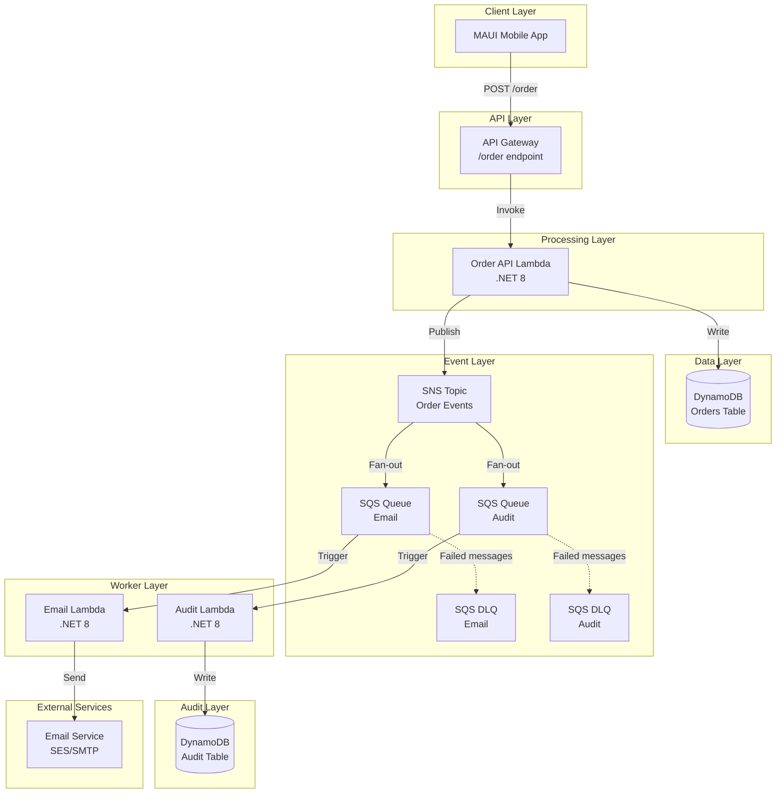
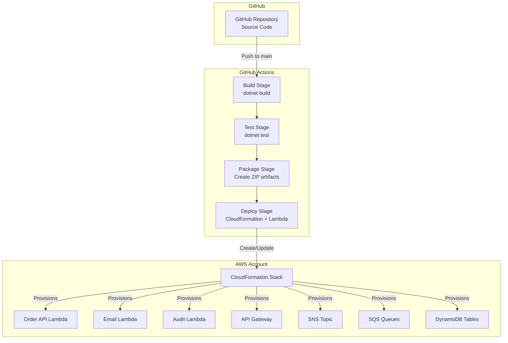

# Design Document: AWS Order Processing POC

## Overview

This design document specifies the architecture and implementation details for an AWS event-driven order processing system. The system demonstrates modern cloud-native patterns using serverless technologies and infrastructure as code.

### System Purpose

The system accepts order submissions from a .NET MAUI mobile application and processes them through independent workflows for email notifications and audit logging. It serves as a proof-of-concept for event-driven architecture on AWS using .NET 8 Lambda functions.

### Key Design Principles

- **Event-Driven Architecture**: Use SNS/SQS fan-out pattern for decoupled, asynchronous processing
- **Serverless-First**: Leverage AWS Lambda for compute to minimize operational overhead
- **Infrastructure as Code**: Define all resources in CloudFormation for reproducibility
- **Independent Workflows**: Email and audit processing operate independently to prevent cascading failures
- **Observability**: Structured logging across all components for monitoring and troubleshooting
- **Least Privilege**: IAM roles grant only necessary permissions to each component

### Technology Stack

- **Mobile App**: .NET MAUI (cross-platform mobile application)
- **API Layer**: AWS API Gateway (REST API)
- **Compute**: AWS Lambda with .NET 8 runtime
- **Messaging**: Amazon SNS (pub/sub) and Amazon SQS (queuing)
- **Data Storage**: Amazon DynamoDB (NoSQL database)
- **Infrastructure**: AWS CloudFormation (IaC)
- **CI/CD**: GitHub Actions
- **Logging**: AWS CloudWatch Logs


## Architecture

### High-Level Architecture

The system follows an event-driven architecture with three main processing stages:

1. **Order Ingestion**: API Gateway receives orders from the mobile app and invokes the Order API Lambda
2. **Event Publishing**: Order API persists orders to DynamoDB and publishes events to SNS
3. **Parallel Processing**: SNS fans out to SQS queues, triggering independent Email and Audit Lambda functions




### Request Flow

#### Successful Order Submission Flow

1. MAUI app sends POST request to API Gateway `/order` endpoint
2. API Gateway validates request format and invokes Order API Lambda
3. Order API Lambda validates order data structure
4. Order API Lambda generates unique order ID (GUID)
5. Order API Lambda writes order to DynamoDB Orders table
6. Order API Lambda publishes order event to SNS topic
7. SNS delivers message to both Email Queue and Audit Queue
8. Order API Lambda returns HTTP 200 with order confirmation
9. Email Lambda processes message from Email Queue asynchronously
10. Audit Lambda processes message from Audit Queue asynchronously

#### Error Handling Flow

**Validation Failure:**
- Order API validates request → returns HTTP 400 with validation errors
- No database write, no event published

**Database Write Failure:**
- Order API attempts DynamoDB write → fails
- Returns HTTP 500 with error details
- No event published (maintains consistency)

**SNS Publish Failure:**
- Order API writes to DynamoDB successfully
- SNS publish fails → logs error, returns HTTP 500
- Order persisted but workflows not triggered (requires manual intervention)

**Email Lambda Failure:**
- Message remains in Email Queue
- Lambda retries up to 3 times
- After 3 failures, message moves to Email DLQ
- Audit workflow continues unaffected

**Audit Lambda Failure:**
- Message remains in Audit Queue
- Lambda retries up to 3 times
- After 3 failures, message moves to Audit DLQ
- Email workflow continues unaffected


### Deployment Architecture




## Components and Interfaces

### 1. MAUI Mobile Application

**Responsibility**: Provide user interface for order submission

**Technology**: .NET MAUI (Multi-platform App UI)

**Key Features**:
- Cross-platform (iOS, Android)
- Order entry form with validation
- HTTP client for API communication
- Error handling and user feedback

**API Integration**:
- Endpoint: `POST https://{api-gateway-url}/order`
- Content-Type: `application/json`
- Timeout: 30 seconds
- Retry logic: 2 retries with exponential backoff

### 2. API Gateway

**Responsibility**: Expose REST API endpoint and route requests to Lambda

**Configuration**:
- Type: REST API
- Endpoint: `/order`
- Method: POST
- Integration: Lambda Proxy Integration
- CORS: Enabled for mobile app origin
- Throttling: 100 requests per second
- API Key: Optional (for production)

**Request Validation**:
- Content-Type must be `application/json`
- Request body size limit: 10 KB
- Timeout: 29 seconds (Lambda timeout + buffer)

**Response Codes**:
- 200: Order accepted
- 400: Validation error
- 500: Internal server error
- 503: Service unavailable


### 3. Order API Lambda Function

**Responsibility**: Validate orders, persist to DynamoDB, publish events to SNS

**Runtime**: .NET 8 (Amazon.Lambda.AspNetCoreServer)

**Configuration**:
- Memory: 512 MB
- Timeout: 30 seconds
- Environment Variables:
  - `ORDER_TABLE_NAME`: DynamoDB table name
  - `ORDER_TOPIC_ARN`: SNS topic ARN
  - `LOG_LEVEL`: INFO

**Dependencies**:
- AWSSDK.DynamoDBv2
- AWSSDK.SimpleNotificationService
- Amazon.Lambda.Core
- Amazon.Lambda.APIGatewayEvents
- FluentValidation (for order validation)

**Processing Logic**:
1. Deserialize request body to Order object
2. Validate order using FluentValidation rules
3. Generate unique OrderId (GUID)
4. Add timestamp metadata (CreatedAt)
5. Write to DynamoDB Orders table
6. Publish order event to SNS topic
7. Return success response with OrderId

**Error Handling**:
- Validation errors: Return 400 with error list
- DynamoDB errors: Log and return 500
- SNS errors: Log and return 500
- Unexpected errors: Log with stack trace, return 500

**IAM Permissions Required**:
- `dynamodb:PutItem` on Orders table
- `sns:Publish` on Order topic
- `logs:CreateLogGroup`, `logs:CreateLogStream`, `logs:PutLogEvents`


### 4. Email Lambda Function

**Responsibility**: Send order confirmation emails to customers

**Runtime**: .NET 8 (Amazon.Lambda.Core)

**Configuration**:
- Memory: 256 MB
- Timeout: 60 seconds
- Batch Size: 1 (process one message at a time)
- Max Retry: 3
- Environment Variables:
  - `EMAIL_FROM`: Sender email address
  - `SMTP_HOST`: SMTP server host (or use SES)
  - `SMTP_PORT`: SMTP server port
  - `LOG_LEVEL`: INFO

**Dependencies**:
- AWSSDK.SimpleEmail (if using SES)
- Amazon.Lambda.Core
- Amazon.Lambda.SQSEvents
- MailKit (if using SMTP)

**Processing Logic**:
1. Receive SQS event with order data
2. Parse order details from message body
3. Generate email content (HTML template)
4. Send email via SES or SMTP
5. Delete message from queue (automatic on success)

**Email Template**:
- Subject: "Order Confirmation - Order #{OrderId}"
- Body: HTML formatted with order details
- Include: Customer name, order items, total, order ID, timestamp

**Error Handling**:
- Email send failure: Throw exception to trigger retry
- After 3 retries: Message moves to DLQ
- Log all attempts with order ID

**IAM Permissions Required**:
- `sqs:ReceiveMessage`, `sqs:DeleteMessage` on Email Queue
- `ses:SendEmail` (if using SES)
- `logs:CreateLogGroup`, `logs:CreateLogStream`, `logs:PutLogEvents`


### 5. Audit Lambda Function

**Responsibility**: Log audit records for all order submissions

**Runtime**: .NET 8 (Amazon.Lambda.Core)

**Configuration**:
- Memory: 256 MB
- Timeout: 30 seconds
- Batch Size: 1 (process one message at a time)
- Max Retry: 3
- Environment Variables:
  - `AUDIT_TABLE_NAME`: DynamoDB table name
  - `LOG_LEVEL`: INFO

**Dependencies**:
- AWSSDK.DynamoDBv2
- Amazon.Lambda.Core
- Amazon.Lambda.SQSEvents

**Processing Logic**:
1. Receive SQS event with order data
2. Parse order details from message body
3. Create audit record with:
   - AuditId (GUID)
   - OrderId
   - EventType: "ORDER_CREATED"
   - Timestamp
   - Order details (customer, items)
4. Write to DynamoDB Audit table
5. Delete message from queue (automatic on success)

**Error Handling**:
- DynamoDB write failure: Throw exception to trigger retry
- After 3 retries: Message moves to DLQ
- Log all attempts with order ID

**IAM Permissions Required**:
- `sqs:ReceiveMessage`, `sqs:DeleteMessage` on Audit Queue
- `dynamodb:PutItem` on Audit table
- `logs:CreateLogGroup`, `logs:CreateLogStream`, `logs:PutLogEvents`


### 6. SNS Topic (Order Events)

**Responsibility**: Publish order events and fan out to multiple subscribers

**Configuration**:
- Name: `OrderEventsTopic`
- Type: Standard (not FIFO, order not critical)
- Subscriptions:
  - Email Queue (SQS)
  - Audit Queue (SQS)
- Message Retention: Default (not applicable for SNS)
- Encryption: AWS managed keys

**Message Format**:
```json
{
  "orderId": "guid",
  "customerId": "string",
  "customerName": "string",
  "customerEmail": "string",
  "items": [...],
  "totalAmount": "decimal",
  "createdAt": "ISO8601 timestamp"
}
```

### 7. SQS Queues

**Email Queue Configuration**:
- Name: `OrderEmailQueue`
- Visibility Timeout: 70 seconds (Lambda timeout + buffer)
- Message Retention: 4 days
- Receive Wait Time: 20 seconds (long polling)
- Max Receive Count: 3
- Dead Letter Queue: `OrderEmailDLQ`

**Audit Queue Configuration**:
- Name: `OrderAuditQueue`
- Visibility Timeout: 40 seconds (Lambda timeout + buffer)
- Message Retention: 4 days
- Receive Wait Time: 20 seconds (long polling)
- Max Receive Count: 3
- Dead Letter Queue: `OrderAuditDLQ`

**Dead Letter Queue Configuration**:
- Names: `OrderEmailDLQ`, `OrderAuditDLQ`
- Message Retention: 14 days
- Alarm: CloudWatch alarm when message count > 0


### 8. DynamoDB Tables

**Orders Table**:
- Table Name: `Orders`
- Partition Key: `OrderId` (String)
- Billing Mode: On-Demand (pay per request)
- Attributes:
  - OrderId (String, PK)
  - CustomerId (String)
  - CustomerName (String)
  - CustomerEmail (String)
  - Items (List)
  - TotalAmount (Number)
  - CreatedAt (String, ISO8601)
- GSI: None (simple key-value access pattern)
- Point-in-Time Recovery: Enabled
- Encryption: AWS managed keys

**Audit Table**:
- Table Name: `AuditLogs`
- Partition Key: `AuditId` (String)
- Sort Key: `Timestamp` (String)
- Billing Mode: On-Demand
- Attributes:
  - AuditId (String, PK)
  - Timestamp (String, SK, ISO8601)
  - OrderId (String)
  - EventType (String)
  - OrderDetails (Map)
- GSI: `OrderIdIndex`
  - Partition Key: OrderId
  - Sort Key: Timestamp
  - Purpose: Query all audit records for a specific order
- Point-in-Time Recovery: Enabled
- Encryption: AWS managed keys


## Data Models

### Order Model

```csharp
public class Order
{
    public string OrderId { get; set; }  // GUID, generated by Order API
    public string CustomerId { get; set; }  // Optional customer identifier
    public string CustomerName { get; set; }  // Required, min 2 chars
    public string CustomerEmail { get; set; }  // Required, valid email format
    public List<OrderItem> Items { get; set; }  // Required, min 1 item
    public decimal TotalAmount { get; set; }  // Calculated from items
    public DateTime CreatedAt { get; set; }  // UTC timestamp
}

public class OrderItem
{
    public string ProductId { get; set; }  // Required
    public string ProductName { get; set; }  // Optional
    public int Quantity { get; set; }  // Required, positive integer
    public decimal Price { get; set; }  // Required, positive decimal
    public decimal Subtotal { get; set; }  // Calculated: Quantity * Price
}
```

### Validation Rules

**Order Validation**:
- `CustomerName`: Required, minimum 2 characters, maximum 100 characters
- `CustomerEmail`: Required, valid email format (RFC 5322)
- `Items`: Required, must contain at least 1 item, maximum 50 items
- `TotalAmount`: Must equal sum of all item subtotals

**OrderItem Validation**:
- `ProductId`: Required, non-empty string
- `Quantity`: Required, positive integer (> 0), maximum 1000
- `Price`: Required, positive decimal (> 0), maximum 999999.99
- `Subtotal`: Must equal Quantity * Price


### Audit Record Model

```csharp
public class AuditRecord
{
    public string AuditId { get; set; }  // GUID, generated by Audit Lambda
    public string Timestamp { get; set; }  // ISO8601 format
    public string OrderId { get; set; }  // Reference to order
    public string EventType { get; set; }  // "ORDER_CREATED"
    public OrderDetails OrderDetails { get; set; }  // Snapshot of order data
}

public class OrderDetails
{
    public string CustomerId { get; set; }
    public string CustomerName { get; set; }
    public string CustomerEmail { get; set; }
    public int ItemCount { get; set; }
    public decimal TotalAmount { get; set; }
}
```

### API Request/Response Models

**POST /order Request**:
```json
{
  "customerId": "CUST-12345",
  "customerName": "John Doe",
  "customerEmail": "john.doe@example.com",
  "items": [
    {
      "productId": "PROD-001",
      "productName": "Widget A",
      "quantity": 2,
      "price": 29.99
    },
    {
      "productId": "PROD-002",
      "productName": "Widget B",
      "quantity": 1,
      "price": 49.99
    }
  ]
}
```

**Success Response (200)**:
```json
{
  "orderId": "550e8400-e29b-41d4-a716-446655440000",
  "message": "Order received successfully",
  "createdAt": "2024-01-15T10:30:00Z"
}
```

**Validation Error Response (400)**:
```json
{
  "error": "Validation failed",
  "errors": [
    {
      "field": "customerEmail",
      "message": "Invalid email format"
    },
    {
      "field": "items[0].quantity",
      "message": "Quantity must be greater than 0"
    }
  ]
}
```

**Server Error Response (500)**:
```json
{
  "error": "Internal server error",
  "message": "Failed to process order",
  "requestId": "abc-123-def-456"
}
```


## Correctness Properties

*A property is a characteristic or behavior that should hold true across all valid executions of a system-essentially, a formal statement about what the system should do. Properties serve as the bridge between human-readable specifications and machine-verifiable correctness guarantees.*

### Property 1: Valid Order Processing

*For any* valid order submitted to the API, the system SHALL return HTTP 200, persist the order to the Orders table, and publish an event to the Order Topic containing the complete order data.

**Validates: Requirements 1.3, 2.1, 3.1, 3.2**

### Property 2: Invalid Order Rejection

*For any* invalid order submitted to the API (missing required fields, invalid formats, or constraint violations), the system SHALL return HTTP 400 with all validation errors listed in the response.

**Validates: Requirements 1.4, 10.7**

### Property 3: Order ID Uniqueness

*For any* set of orders submitted to the system, all generated order IDs SHALL be unique.

**Validates: Requirements 2.2**

### Property 4: Order Timestamp Presence

*For any* order persisted to the Orders table, the order record SHALL include a CreatedAt timestamp in ISO8601 format.

**Validates: Requirements 2.3**


### Property 5: SNS Fan-Out Delivery

*For any* order event published to the Order Topic, the message SHALL be delivered to both the Email Queue and the Audit Queue independently.

**Validates: Requirements 3.4, 8.1**

### Property 6: Email Lambda Message Processing

*For any* valid order message in the Email Queue, the Email Lambda SHALL extract the order details and send a confirmation email to the customer email address specified in the order.

**Validates: Requirements 4.2, 4.3**

### Property 7: Audit Lambda Record Creation

*For any* valid order message in the Audit Queue, the Audit Lambda SHALL create an audit record containing the order ID, event type, timestamp, and order details, and persist it to the Audit table.

**Validates: Requirements 5.2, 5.3**

### Property 8: Email Validation

*For any* order with a customer email that does not conform to valid email format (RFC 5322), the Order API SHALL reject the order with a validation error.

**Validates: Requirements 10.1**

### Property 9: Customer Name Validation

*For any* order with a customer name containing fewer than 2 characters, the Order API SHALL reject the order with a validation error.

**Validates: Requirements 10.2**

### Property 10: Order Items Validation

*For any* order with an empty items list, the Order API SHALL reject the order with a validation error.

**Validates: Requirements 10.3**


### Property 11: Order Item Required Fields

*For any* order item missing product ID, quantity, or price, the Order API SHALL reject the order with a validation error specifying the missing field.

**Validates: Requirements 10.4**

### Property 12: Quantity Validation

*For any* order item with a quantity less than or equal to zero, the Order API SHALL reject the order with a validation error.

**Validates: Requirements 10.5**

### Property 13: Price Validation

*For any* order item with a price less than or equal to zero, the Order API SHALL reject the order with a validation error.

**Validates: Requirements 10.6**

### Property 14: Request Logging

*For any* request received by the Order API, the system SHALL create a log entry containing the request ID and request details.

**Validates: Requirements 9.1**

### Property 15: Validation Error Logging

*For any* order that fails validation, the Order API SHALL create a log entry containing the validation errors and request ID.

**Validates: Requirements 9.2**

### Property 16: Lambda Error Logging

*For any* error encountered by any Lambda function, the system SHALL create a log entry containing the error message, stack trace, and context information.

**Validates: Requirements 9.5**


### Property 17: Structured Logging Format

*For any* log entry created by any component in the system, the log SHALL follow a consistent structured format including timestamp, log level, component name, and message.

**Validates: Requirements 9.6**

### Property 18: Workflow Independence

*For any* order processed by the system, if the Email Lambda fails to process the order message, the Audit Lambda SHALL continue to process its copy of the message successfully, and vice versa.

**Validates: Requirements 8.2, 8.3**


## Error Handling

### Order API Error Handling

**Validation Errors**:
- Use FluentValidation to collect all validation errors
- Return HTTP 400 with structured error response
- Include field name and error message for each violation
- Log validation failures with request ID

**DynamoDB Errors**:
- Catch `AmazonDynamoDBException`
- Log error with stack trace and request ID
- Return HTTP 500 with generic error message (don't expose internal details)
- Consider implementing retry logic with exponential backoff for transient errors

**SNS Errors**:
- Catch `AmazonSimpleNotificationServiceException`
- Log error with stack trace and order ID
- Return HTTP 500 (order persisted but event not published)
- Alert operations team for manual intervention

**Unexpected Errors**:
- Catch all unhandled exceptions
- Log with full stack trace and context
- Return HTTP 500 with request ID for tracking
- CloudWatch alarm on error rate threshold


### Email Lambda Error Handling

**Email Service Errors**:
- Catch email sending exceptions (SES or SMTP)
- Log error with order ID and customer email
- Throw exception to trigger SQS retry
- After 3 retries, message moves to Email DLQ

**Message Parsing Errors**:
- Catch JSON deserialization exceptions
- Log error with raw message content
- Move message to DLQ (invalid message format)

**Dead Letter Queue Monitoring**:
- CloudWatch alarm when Email DLQ message count > 0
- Operations team investigates and manually reprocesses or discards

### Audit Lambda Error Handling

**DynamoDB Errors**:
- Catch `AmazonDynamoDBException`
- Log error with order ID
- Throw exception to trigger SQS retry
- After 3 retries, message moves to Audit DLQ

**Message Parsing Errors**:
- Catch JSON deserialization exceptions
- Log error with raw message content
- Move message to DLQ (invalid message format)

**Dead Letter Queue Monitoring**:
- CloudWatch alarm when Audit DLQ message count > 0
- Operations team investigates and manually reprocesses or discards


### Retry Strategy

**Order API**:
- No automatic retries (client responsible for retry)
- Idempotency: Consider adding idempotency key support for safe retries

**Email Lambda**:
- SQS automatic retry: 3 attempts
- Visibility timeout: 70 seconds (allows Lambda to complete or timeout)
- Exponential backoff: Handled by SQS

**Audit Lambda**:
- SQS automatic retry: 3 attempts
- Visibility timeout: 40 seconds
- Exponential backoff: Handled by SQS

### Circuit Breaker Pattern

For production systems, consider implementing circuit breaker for:
- Email service calls (prevent overwhelming email provider)
- DynamoDB calls (handle throttling gracefully)

Not implemented in POC but recommended for production.


## CloudFormation Template Structure

### Template Organization

The CloudFormation template will be organized into logical sections:

```yaml
AWSTemplateFormatVersion: '2010-09-09'
Description: 'AWS Order Processing POC - Event-Driven Architecture'

Parameters:
  Environment:
    Type: String
    Default: dev
    AllowedValues: [dev, staging, prod]
  
Resources:
  # DynamoDB Tables
  OrdersTable:
    Type: AWS::DynamoDB::Table
  
  AuditLogsTable:
    Type: AWS::DynamoDB::Table
  
  # SNS Topic
  OrderEventsTopic:
    Type: AWS::SNS::Topic
  
  # SQS Queues
  OrderEmailQueue:
    Type: AWS::SQS::Queue
  
  OrderEmailDLQ:
    Type: AWS::SQS::Queue
  
  OrderAuditQueue:
    Type: AWS::SQS::Queue
  
  OrderAuditDLQ:
    Type: AWS::SQS::Queue
  
  # SNS Subscriptions
  EmailQueueSubscription:
    Type: AWS::SNS::Subscription
  
  AuditQueueSubscription:
    Type: AWS::SNS::Subscription
  
  # IAM Roles
  OrderApiRole:
    Type: AWS::IAM::Role
  
  EmailLambdaRole:
    Type: AWS::IAM::Role
  
  AuditLambdaRole:
    Type: AWS::IAM::Role
  
  # Lambda Functions
  OrderApiFunction:
    Type: AWS::Lambda::Function
  
  EmailLambdaFunction:
    Type: AWS::Lambda::Function
  
  AuditLambdaFunction:
    Type: AWS::Lambda::Function
  
  # API Gateway
  OrderApi:
    Type: AWS::ApiGateway::RestApi
  
  OrderResource:
    Type: AWS::ApiGateway::Resource
  
  OrderMethod:
    Type: AWS::ApiGateway::Method
  
  ApiDeployment:
    Type: AWS::ApiGateway::Deployment
  
  ApiStage:
    Type: AWS::ApiGateway::Stage

Outputs:
  ApiEndpoint:
    Description: API Gateway endpoint URL
    Value: !Sub 'https://${OrderApi}.execute-api.${AWS::Region}.amazonaws.com/${Environment}'
  
  OrdersTableName:
    Description: Orders DynamoDB table name
    Value: !Ref OrdersTable
  
  AuditLogsTableName:
    Description: Audit logs DynamoDB table name
    Value: !Ref AuditLogsTable
```


### Key Resource Configurations

**DynamoDB Tables**:
```yaml
OrdersTable:
  Type: AWS::DynamoDB::Table
  Properties:
    TableName: !Sub '${Environment}-Orders'
    BillingMode: PAY_PER_REQUEST
    AttributeDefinitions:
      - AttributeName: OrderId
        AttributeType: S
    KeySchema:
      - AttributeName: OrderId
        KeyType: HASH
    PointInTimeRecoverySpecification:
      PointInTimeRecoveryEnabled: true
    SSESpecification:
      SSEEnabled: true

AuditLogsTable:
  Type: AWS::DynamoDB::Table
  Properties:
    TableName: !Sub '${Environment}-AuditLogs'
    BillingMode: PAY_PER_REQUEST
    AttributeDefinitions:
      - AttributeName: AuditId
        AttributeType: S
      - AttributeName: Timestamp
        AttributeType: S
      - AttributeName: OrderId
        AttributeType: S
    KeySchema:
      - AttributeName: AuditId
        KeyType: HASH
      - AttributeName: Timestamp
        KeyType: RANGE
    GlobalSecondaryIndexes:
      - IndexName: OrderIdIndex
        KeySchema:
          - AttributeName: OrderId
            KeyType: HASH
          - AttributeName: Timestamp
            KeyType: RANGE
        Projection:
          ProjectionType: ALL
    PointInTimeRecoverySpecification:
      PointInTimeRecoveryEnabled: true
    SSESpecification:
      SSEEnabled: true
```


**SQS Queues with DLQ**:
```yaml
OrderEmailDLQ:
  Type: AWS::SQS::Queue
  Properties:
    QueueName: !Sub '${Environment}-OrderEmailDLQ'
    MessageRetentionPeriod: 1209600  # 14 days

OrderEmailQueue:
  Type: AWS::SQS::Queue
  Properties:
    QueueName: !Sub '${Environment}-OrderEmailQueue'
    VisibilityTimeout: 70
    ReceiveMessageWaitTimeSeconds: 20
    MessageRetentionPeriod: 345600  # 4 days
    RedrivePolicy:
      deadLetterTargetArn: !GetAtt OrderEmailDLQ.Arn
      maxReceiveCount: 3

OrderAuditDLQ:
  Type: AWS::SQS::Queue
  Properties:
    QueueName: !Sub '${Environment}-OrderAuditDLQ'
    MessageRetentionPeriod: 1209600  # 14 days

OrderAuditQueue:
  Type: AWS::SQS::Queue
  Properties:
    QueueName: !Sub '${Environment}-OrderAuditQueue'
    VisibilityTimeout: 40
    ReceiveMessageWaitTimeSeconds: 20
    MessageRetentionPeriod: 345600  # 4 days
    RedrivePolicy:
      deadLetterTargetArn: !GetAtt OrderAuditDLQ.Arn
      maxReceiveCount: 3
```

**SNS Topic and Subscriptions**:
```yaml
OrderEventsTopic:
  Type: AWS::SNS::Topic
  Properties:
    TopicName: !Sub '${Environment}-OrderEvents'
    DisplayName: Order Events Topic

EmailQueueSubscription:
  Type: AWS::SNS::Subscription
  Properties:
    Protocol: sqs
    TopicArn: !Ref OrderEventsTopic
    Endpoint: !GetAtt OrderEmailQueue.Arn
    RawMessageDelivery: true

AuditQueueSubscription:
  Type: AWS::SNS::Subscription
  Properties:
    Protocol: sqs
    TopicArn: !Ref OrderEventsTopic
    Endpoint: !GetAtt OrderAuditQueue.Arn
    RawMessageDelivery: true
```


**IAM Roles**:
```yaml
OrderApiRole:
  Type: AWS::IAM::Role
  Properties:
    RoleName: !Sub '${Environment}-OrderApiRole'
    AssumeRolePolicyDocument:
      Version: '2012-10-17'
      Statement:
        - Effect: Allow
          Principal:
            Service: lambda.amazonaws.com
          Action: sts:AssumeRole
    ManagedPolicyArns:
      - arn:aws:iam::aws:policy/service-role/AWSLambdaBasicExecutionRole
    Policies:
      - PolicyName: OrderApiPolicy
        PolicyDocument:
          Version: '2012-10-17'
          Statement:
            - Effect: Allow
              Action:
                - dynamodb:PutItem
              Resource: !GetAtt OrdersTable.Arn
            - Effect: Allow
              Action:
                - sns:Publish
              Resource: !Ref OrderEventsTopic

EmailLambdaRole:
  Type: AWS::IAM::Role
  Properties:
    RoleName: !Sub '${Environment}-EmailLambdaRole'
    AssumeRolePolicyDocument:
      Version: '2012-10-17'
      Statement:
        - Effect: Allow
          Principal:
            Service: lambda.amazonaws.com
          Action: sts:AssumeRole
    ManagedPolicyArns:
      - arn:aws:iam::aws:policy/service-role/AWSLambdaBasicExecutionRole
    Policies:
      - PolicyName: EmailLambdaPolicy
        PolicyDocument:
          Version: '2012-10-17'
          Statement:
            - Effect: Allow
              Action:
                - sqs:ReceiveMessage
                - sqs:DeleteMessage
                - sqs:GetQueueAttributes
              Resource: !GetAtt OrderEmailQueue.Arn
            - Effect: Allow
              Action:
                - ses:SendEmail
                - ses:SendRawEmail
              Resource: '*'

AuditLambdaRole:
  Type: AWS::IAM::Role
  Properties:
    RoleName: !Sub '${Environment}-AuditLambdaRole'
    AssumeRolePolicyDocument:
      Version: '2012-10-17'
      Statement:
        - Effect: Allow
          Principal:
            Service: lambda.amazonaws.com
          Action: sts:AssumeRole
    ManagedPolicyArns:
      - arn:aws:iam::aws:policy/service-role/AWSLambdaBasicExecutionRole
    Policies:
      - PolicyName: AuditLambdaPolicy
        PolicyDocument:
          Version: '2012-10-17'
          Statement:
            - Effect: Allow
              Action:
                - sqs:ReceiveMessage
                - sqs:DeleteMessage
                - sqs:GetQueueAttributes
              Resource: !GetAtt OrderAuditQueue.Arn
            - Effect: Allow
              Action:
                - dynamodb:PutItem
              Resource: !GetAtt AuditLogsTable.Arn
```


**Lambda Functions**:
```yaml
OrderApiFunction:
  Type: AWS::Lambda::Function
  Properties:
    FunctionName: !Sub '${Environment}-OrderApi'
    Runtime: dotnet8
    Handler: OrderApi::OrderApi.Function::FunctionHandler
    Code:
      S3Bucket: !Ref DeploymentBucket
      S3Key: !Sub 'lambda/order-api-${Version}.zip'
    Role: !GetAtt OrderApiRole.Arn
    MemorySize: 512
    Timeout: 30
    Environment:
      Variables:
        ORDER_TABLE_NAME: !Ref OrdersTable
        ORDER_TOPIC_ARN: !Ref OrderEventsTopic
        LOG_LEVEL: INFO

EmailLambdaFunction:
  Type: AWS::Lambda::Function
  Properties:
    FunctionName: !Sub '${Environment}-EmailLambda'
    Runtime: dotnet8
    Handler: EmailLambda::EmailLambda.Function::FunctionHandler
    Code:
      S3Bucket: !Ref DeploymentBucket
      S3Key: !Sub 'lambda/email-lambda-${Version}.zip'
    Role: !GetAtt EmailLambdaRole.Arn
    MemorySize: 256
    Timeout: 60
    Environment:
      Variables:
        EMAIL_FROM: noreply@example.com
        LOG_LEVEL: INFO

EmailEventSourceMapping:
  Type: AWS::Lambda::EventSourceMapping
  Properties:
    EventSourceArn: !GetAtt OrderEmailQueue.Arn
    FunctionName: !Ref EmailLambdaFunction
    BatchSize: 1

AuditLambdaFunction:
  Type: AWS::Lambda::Function
  Properties:
    FunctionName: !Sub '${Environment}-AuditLambda'
    Runtime: dotnet8
    Handler: AuditLambda::AuditLambda.Function::FunctionHandler
    Code:
      S3Bucket: !Ref DeploymentBucket
      S3Key: !Sub 'lambda/audit-lambda-${Version}.zip'
    Role: !GetAtt AuditLambdaRole.Arn
    MemorySize: 256
    Timeout: 30
    Environment:
      Variables:
        AUDIT_TABLE_NAME: !Ref AuditLogsTable
        LOG_LEVEL: INFO

AuditEventSourceMapping:
  Type: AWS::Lambda::EventSourceMapping
  Properties:
    EventSourceArn: !GetAtt OrderAuditQueue.Arn
    FunctionName: !Ref AuditLambdaFunction
    BatchSize: 1
```


## CI/CD Pipeline Design

### GitHub Actions Workflow

**Workflow File**: `.github/workflows/deploy.yml`

```yaml
name: Build and Deploy

on:
  push:
    branches:
      - main
  pull_request:
    branches:
      - main

env:
  AWS_REGION: us-east-1
  DOTNET_VERSION: '8.0.x'

jobs:
  build-and-test:
    runs-on: ubuntu-latest
    
    steps:
      - name: Checkout code
        uses: actions/checkout@v3
      
      - name: Setup .NET
        uses: actions/setup-dotnet@v3
        with:
          dotnet-version: ${{ env.DOTNET_VERSION }}
      
      - name: Restore dependencies
        run: |
          dotnet restore src/OrderApi/OrderApi.csproj
          dotnet restore src/EmailLambda/EmailLambda.csproj
          dotnet restore src/AuditLambda/AuditLambda.csproj
      
      - name: Build
        run: |
          dotnet build src/OrderApi/OrderApi.csproj --configuration Release --no-restore
          dotnet build src/EmailLambda/EmailLambda.csproj --configuration Release --no-restore
          dotnet build src/AuditLambda/AuditLambda.csproj --configuration Release --no-restore
      
      - name: Run unit tests
        run: |
          dotnet test tests/OrderApi.Tests/OrderApi.Tests.csproj --configuration Release --no-build
          dotnet test tests/EmailLambda.Tests/EmailLambda.Tests.csproj --configuration Release --no-build
          dotnet test tests/AuditLambda.Tests/AuditLambda.Tests.csproj --configuration Release --no-build
      
      - name: Package Lambda functions
        run: |
          dotnet publish src/OrderApi/OrderApi.csproj -c Release -o publish/order-api
          dotnet publish src/EmailLambda/EmailLambda.csproj -c Release -o publish/email-lambda
          dotnet publish src/AuditLambda/AuditLambda.csproj -c Release -o publish/audit-lambda
          
          cd publish/order-api && zip -r ../../order-api.zip . && cd ../..
          cd publish/email-lambda && zip -r ../../email-lambda.zip . && cd ../..
          cd publish/audit-lambda && zip -r ../../audit-lambda.zip . && cd ../..
      
      - name: Upload artifacts
        uses: actions/upload-artifact@v3
        with:
          name: lambda-packages
          path: |
            order-api.zip
            email-lambda.zip
            audit-lambda.zip
  
  deploy:
    needs: build-and-test
    runs-on: ubuntu-latest
    if: github.ref == 'refs/heads/main'
    
    steps:
      - name: Checkout code
        uses: actions/checkout@v3
      
      - name: Download artifacts
        uses: actions/download-artifact@v3
        with:
          name: lambda-packages
      
      - name: Configure AWS credentials
        uses: aws-actions/configure-aws-credentials@v2
        with:
          aws-access-key-id: ${{ secrets.AWS_ACCESS_KEY_ID }}
          aws-secret-access-key: ${{ secrets.AWS_SECRET_ACCESS_KEY }}
          aws-region: ${{ env.AWS_REGION }}
      
      - name: Upload Lambda packages to S3
        run: |
          aws s3 cp order-api.zip s3://${{ secrets.DEPLOYMENT_BUCKET }}/lambda/order-api-${{ github.sha }}.zip
          aws s3 cp email-lambda.zip s3://${{ secrets.DEPLOYMENT_BUCKET }}/lambda/email-lambda-${{ github.sha }}.zip
          aws s3 cp audit-lambda.zip s3://${{ secrets.DEPLOYMENT_BUCKET }}/lambda/audit-lambda-${{ github.sha }}.zip
      
      - name: Deploy CloudFormation stack
        run: |
          aws cloudformation deploy \
            --template-file infrastructure/template.yaml \
            --stack-name order-processing-poc-dev \
            --parameter-overrides \
              Environment=dev \
              Version=${{ github.sha }} \
              DeploymentBucket=${{ secrets.DEPLOYMENT_BUCKET }} \
            --capabilities CAPABILITY_NAMED_IAM \
            --no-fail-on-empty-changeset
      
      - name: Update Lambda function code
        run: |
          aws lambda update-function-code \
            --function-name dev-OrderApi \
            --s3-bucket ${{ secrets.DEPLOYMENT_BUCKET }} \
            --s3-key lambda/order-api-${{ github.sha }}.zip
          
          aws lambda update-function-code \
            --function-name dev-EmailLambda \
            --s3-bucket ${{ secrets.DEPLOYMENT_BUCKET }} \
            --s3-key lambda/email-lambda-${{ github.sha }}.zip
          
          aws lambda update-function-code \
            --function-name dev-AuditLambda \
            --s3-bucket ${{ secrets.DEPLOYMENT_BUCKET }} \
            --s3-key lambda/audit-lambda-${{ github.sha }}.zip
```


### Pipeline Stages

**Stage 1: Build**
- Checkout source code from GitHub
- Setup .NET 8 SDK
- Restore NuGet dependencies for all projects
- Build all Lambda projects in Release configuration
- Duration: ~2 minutes

**Stage 2: Test**
- Execute unit tests for all Lambda functions
- Execute property-based tests (100 iterations each)
- Generate code coverage report
- Fail pipeline if any test fails or coverage < 80%
- Duration: ~3 minutes

**Stage 3: Package**
- Publish Lambda projects with dependencies
- Create ZIP archives for each Lambda function
- Upload artifacts to GitHub Actions storage
- Duration: ~1 minute

**Stage 4: Deploy** (main branch only)
- Download Lambda ZIP artifacts
- Configure AWS credentials from GitHub Secrets
- Upload Lambda packages to S3 deployment bucket
- Deploy/update CloudFormation stack
- Update Lambda function code with new versions
- Duration: ~3 minutes

**Total Pipeline Duration**: ~9 minutes (well under 10-minute requirement)


### Required GitHub Secrets

- `AWS_ACCESS_KEY_ID`: AWS access key for deployment
- `AWS_SECRET_ACCESS_KEY`: AWS secret key for deployment
- `DEPLOYMENT_BUCKET`: S3 bucket name for Lambda packages

### Deployment Strategy

**Development Environment**:
- Automatic deployment on every push to main
- Uses `dev` environment parameter
- Separate AWS account or isolated resources

**Staging Environment** (future):
- Manual approval required
- Triggered after successful dev deployment
- Uses `staging` environment parameter

**Production Environment** (future):
- Manual approval required
- Triggered after successful staging validation
- Uses `prod` environment parameter
- Blue/green deployment strategy
- Automated rollback on errors

### Rollback Strategy

**Automatic Rollback**:
- CloudFormation automatically rolls back on stack update failure
- Lambda versions allow quick rollback to previous version

**Manual Rollback**:
- Redeploy previous Git commit
- Use CloudFormation stack rollback feature
- Update Lambda function code to previous S3 version


## Monitoring and Observability

### CloudWatch Logs

**Log Groups**:
- `/aws/lambda/dev-OrderApi`
- `/aws/lambda/dev-EmailLambda`
- `/aws/lambda/dev-AuditLambda`

**Log Retention**: 7 days (configurable per environment)

**Structured Logging Format**:
```json
{
  "timestamp": "2024-01-15T10:30:00.123Z",
  "level": "INFO",
  "component": "OrderApi",
  "requestId": "abc-123-def-456",
  "message": "Order received",
  "orderId": "550e8400-e29b-41d4-a716-446655440000",
  "customerId": "CUST-12345"
}
```

### CloudWatch Metrics

**Custom Metrics**:
- `OrdersReceived`: Count of orders submitted
- `OrdersProcessed`: Count of orders successfully processed
- `OrdersFailed`: Count of orders that failed processing
- `ValidationErrors`: Count of validation failures
- `EmailsSent`: Count of emails sent successfully
- `EmailsFailed`: Count of email sending failures
- `AuditRecordsCreated`: Count of audit records created

**AWS Service Metrics**:
- Lambda invocations, errors, duration, throttles
- DynamoDB consumed read/write capacity, throttles
- SQS messages sent, received, deleted, visible
- SNS messages published, failed
- API Gateway requests, latency, 4xx/5xx errors


### CloudWatch Alarms

**Critical Alarms**:
- Lambda error rate > 5% (5-minute period)
- DLQ message count > 0 (immediate alert)
- API Gateway 5xx error rate > 1% (5-minute period)
- Lambda throttles > 0 (immediate alert)

**Warning Alarms**:
- Lambda duration > 80% of timeout (5-minute period)
- DynamoDB throttles > 0 (5-minute period)
- API Gateway 4xx error rate > 10% (5-minute period)

**Alarm Actions**:
- Send notification to SNS topic
- SNS topic triggers email/SMS to operations team
- Consider integration with PagerDuty or similar

### Dashboards

**Operations Dashboard**:
- Order submission rate (requests per minute)
- Success vs. failure rate
- API Gateway latency (p50, p95, p99)
- Lambda execution duration
- DynamoDB read/write capacity usage
- SQS queue depth (messages in queue)
- DLQ message count

**Business Dashboard**:
- Total orders processed (daily, weekly, monthly)
- Order processing funnel (submitted → persisted → emailed → audited)
- Top validation errors
- Email delivery success rate
- Average order processing time


## Project Structure

### Repository Organization

```
aws-order-processing-poc/
├── .github/
│   └── workflows/
│       └── deploy.yml                 # CI/CD pipeline
├── src/
│   ├── OrderApi/
│   │   ├── OrderApi.csproj
│   │   ├── Function.cs                # Lambda entry point
│   │   ├── Models/
│   │   │   ├── Order.cs
│   │   │   ├── OrderItem.cs
│   │   │   └── ApiResponse.cs
│   │   ├── Validators/
│   │   │   └── OrderValidator.cs      # FluentValidation rules
│   │   ├── Services/
│   │   │   ├── IOrderService.cs
│   │   │   ├── OrderService.cs
│   │   │   └── EventPublisher.cs
│   │   └── appsettings.json
│   ├── EmailLambda/
│   │   ├── EmailLambda.csproj
│   │   ├── Function.cs                # Lambda entry point
│   │   ├── Models/
│   │   │   └── OrderEvent.cs
│   │   ├── Services/
│   │   │   ├── IEmailService.cs
│   │   │   └── EmailService.cs
│   │   └── Templates/
│   │       └── OrderConfirmation.html
│   ├── AuditLambda/
│   │   ├── AuditLambda.csproj
│   │   ├── Function.cs                # Lambda entry point
│   │   ├── Models/
│   │   │   ├── AuditRecord.cs
│   │   │   └── OrderEvent.cs
│   │   └── Services/
│   │       ├── IAuditService.cs
│   │       └── AuditService.cs
│   └── Shared/
│       ├── Shared.csproj
│       ├── Models/
│       │   └── OrderDto.cs            # Shared data models
│       └── Logging/
│           └── StructuredLogger.cs
├── tests/
│   ├── OrderApi.Tests/
│   │   ├── OrderApi.Tests.csproj
│   │   ├── UnitTests/
│   │   │   ├── OrderValidatorTests.cs
│   │   │   └── OrderServiceTests.cs
│   │   ├── PropertyTests/
│   │   │   ├── OrderProcessingProperties.cs
│   │   │   └── ValidationProperties.cs
│   │   └── Generators/
│   │       └── OrderGenerators.cs     # FsCheck generators
│   ├── EmailLambda.Tests/
│   │   ├── EmailLambda.Tests.csproj
│   │   ├── UnitTests/
│   │   │   └── EmailServiceTests.cs
│   │   └── PropertyTests/
│   │       └── EmailProcessingProperties.cs
│   ├── AuditLambda.Tests/
│   │   ├── AuditLambda.Tests.csproj
│   │   ├── UnitTests/
│   │   │   └── AuditServiceTests.cs
│   │   └── PropertyTests/
│   │       └── AuditProcessingProperties.cs
│   └── Integration.Tests/
│       ├── Integration.Tests.csproj
│       └── EndToEndTests.cs
├── infrastructure/
│   ├── template.yaml                  # CloudFormation template
│   └── parameters/
│       ├── dev.json
│       ├── staging.json
│       └── prod.json
├── mobile/
│   └── MauiApp/
│       ├── MauiApp.csproj
│       ├── App.xaml
│       ├── MainPage.xaml
│       ├── Services/
│       │   └── OrderApiClient.cs
│       └── Models/
│           └── Order.cs
├── docs/
│   ├── architecture.md
│   ├── deployment.md
│   └── api-reference.md
├── .gitignore
├── README.md
└── LICENSE
```


### Key Dependencies

**OrderApi.csproj**:
```xml
<ItemGroup>
  <PackageReference Include="Amazon.Lambda.Core" Version="2.2.0" />
  <PackageReference Include="Amazon.Lambda.APIGatewayEvents" Version="2.7.0" />
  <PackageReference Include="Amazon.Lambda.Serialization.SystemTextJson" Version="2.4.0" />
  <PackageReference Include="AWSSDK.DynamoDBv2" Version="3.7.300" />
  <PackageReference Include="AWSSDK.SimpleNotificationService" Version="3.7.300" />
  <PackageReference Include="FluentValidation" Version="11.9.0" />
  <PackageReference Include="Microsoft.Extensions.Logging" Version="8.0.0" />
</ItemGroup>
```

**EmailLambda.csproj**:
```xml
<ItemGroup>
  <PackageReference Include="Amazon.Lambda.Core" Version="2.2.0" />
  <PackageReference Include="Amazon.Lambda.SQSEvents" Version="2.2.0" />
  <PackageReference Include="Amazon.Lambda.Serialization.SystemTextJson" Version="2.4.0" />
  <PackageReference Include="AWSSDK.SimpleEmail" Version="3.7.300" />
  <PackageReference Include="Microsoft.Extensions.Logging" Version="8.0.0" />
</ItemGroup>
```

**AuditLambda.csproj**:
```xml
<ItemGroup>
  <PackageReference Include="Amazon.Lambda.Core" Version="2.2.0" />
  <PackageReference Include="Amazon.Lambda.SQSEvents" Version="2.2.0" />
  <PackageReference Include="Amazon.Lambda.Serialization.SystemTextJson" Version="2.4.0" />
  <PackageReference Include="AWSSDK.DynamoDBv2" Version="3.7.300" />
  <PackageReference Include="Microsoft.Extensions.Logging" Version="8.0.0" />
</ItemGroup>
```

**Test Projects**:
```xml
<ItemGroup>
  <PackageReference Include="xunit" Version="2.6.6" />
  <PackageReference Include="xunit.runner.visualstudio" Version="2.5.6" />
  <PackageReference Include="FsCheck" Version="2.16.6" />
  <PackageReference Include="FsCheck.Xunit" Version="2.16.6" />
  <PackageReference Include="Moq" Version="4.20.70" />
  <PackageReference Include="FluentAssertions" Version="6.12.0" />
  <PackageReference Include="Microsoft.NET.Test.Sdk" Version="17.9.0" />
</ItemGroup>
```


## Security Considerations

### Authentication and Authorization

**API Gateway**:
- Consider API key authentication for production
- Rate limiting: 100 requests per second per API key
- CORS configuration for MAUI app origin
- Request validation at API Gateway level

**IAM Roles**:
- Least privilege principle applied to all Lambda roles
- No wildcard permissions except for SES (scoped to verified domains in production)
- Separate roles for each Lambda function
- No hardcoded credentials (use IAM roles)

### Data Protection

**Encryption at Rest**:
- DynamoDB tables encrypted with AWS managed keys
- Consider customer-managed KMS keys for production
- S3 deployment bucket encrypted

**Encryption in Transit**:
- API Gateway enforces HTTPS only
- All AWS service communication uses TLS
- SQS messages encrypted in transit

**Sensitive Data Handling**:
- Customer email addresses stored but not logged in plaintext
- Mask email addresses in logs (e.g., j***@example.com)
- No credit card or payment information in POC
- Consider data retention policies for GDPR compliance


### Input Validation

**API Gateway Level**:
- Request body size limit: 10 KB
- Content-Type validation
- Request schema validation (optional)

**Lambda Level**:
- FluentValidation for comprehensive order validation
- Sanitize inputs to prevent injection attacks
- Validate all required fields before processing
- Reject malformed JSON with clear error messages

### Network Security

**VPC Configuration** (optional for POC):
- Lambda functions can run in VPC for enhanced security
- Private subnets for Lambda functions
- VPC endpoints for DynamoDB and SNS (avoid internet routing)
- Security groups restrict traffic

**API Gateway**:
- Resource policies to restrict access by IP (optional)
- WAF integration for DDoS protection (production)

### Secrets Management

**Environment Variables**:
- Non-sensitive configuration in Lambda environment variables
- Sensitive values (SMTP credentials) in AWS Secrets Manager
- Rotate secrets regularly

**Email Service Credentials**:
- Use SES with IAM role (no credentials needed)
- If using external SMTP, store credentials in Secrets Manager
- Lambda retrieves secrets at runtime


## Implementation Notes

### Development Workflow

1. **Local Development**:
   - Use LocalStack for local AWS service emulation
   - Run Lambda functions locally with AWS SAM CLI
   - Mock external dependencies for unit testing
   - Use Docker for consistent development environment

2. **Testing**:
   - Write tests before implementation (TDD approach)
   - Run unit tests locally before committing
   - Property-based tests catch edge cases
   - Integration tests run in isolated AWS environment

3. **Code Review**:
   - Pull request required for all changes
   - Automated checks: build, test, lint
   - Manual review by team member
   - Merge only after approval and passing checks

4. **Deployment**:
   - Automatic deployment to dev on merge to main
   - Manual promotion to staging/production
   - Monitor CloudWatch after deployment
   - Rollback if errors detected

### Performance Optimization

**Lambda Cold Starts**:
- Keep deployment packages small (< 50 MB)
- Minimize dependencies
- Consider provisioned concurrency for production
- Use Lambda SnapStart for .NET (if available)

**DynamoDB Performance**:
- On-demand billing for unpredictable workload
- Consider provisioned capacity for production with predictable load
- Use batch operations where possible
- Monitor for hot partitions

**SQS Optimization**:
- Long polling (20 seconds) reduces empty receives
- Batch size of 1 for simplicity (increase for higher throughput)
- Visibility timeout > Lambda timeout to prevent duplicate processing


### Cost Optimization

**Lambda**:
- Right-size memory allocation (512 MB for Order API, 256 MB for workers)
- Optimize execution time to reduce costs
- Use ARM64 architecture (Graviton2) for 20% cost savings

**DynamoDB**:
- On-demand billing for POC (no upfront capacity planning)
- Monitor usage and switch to provisioned if cost-effective
- Enable auto-scaling for provisioned capacity

**Data Transfer**:
- Keep Lambda and DynamoDB in same region
- Use VPC endpoints to avoid NAT gateway costs
- Minimize cross-region data transfer

**Monitoring**:
- Set CloudWatch log retention to 7 days (reduce storage costs)
- Use CloudWatch Insights for log analysis (pay per query)
- Archive old logs to S3 for long-term retention

### Future Enhancements

**Idempotency**:
- Add idempotency key support to Order API
- Prevent duplicate order processing on client retry
- Store idempotency keys in DynamoDB with TTL

**Advanced Monitoring**:
- AWS X-Ray for distributed tracing
- Custom metrics for business KPIs
- Real-time dashboards with CloudWatch Live Data

**Scalability**:
- API Gateway caching for read operations
- DynamoDB DAX for caching (if read-heavy)
- SQS FIFO queues for strict ordering (if required)

**Resilience**:
- Multi-region deployment for disaster recovery
- DynamoDB global tables for multi-region replication
- Route 53 health checks and failover

